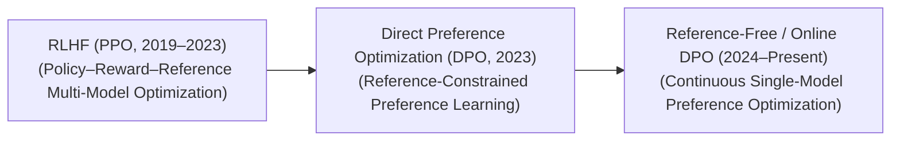

# Awesome-Direct-Preference-Optimization
## Direct Preference Optimization (DPO): History, Progression, Variants, & Applications

Direct Preference Optimization (DPO) is a foundational post-training alignment framework used to steer Large Language Models (LLMs) toward human-preferred behaviors, formatting styles, and safety parameters [INDEX: 11]. Introduced by Rafailov et al. in 2023 ("Direct Preference Optimization: Your Language Model is Secretly a Reward Model"), DPO bypassed the traditional Reinforcement Learning from Human Feedback (RLHF) paradigm [INDEX: 11]. By mathematically reparameterizing the relationship between a language policy and its implicit reward function, DPO proves that an LLM can be fine-tuned directly on pairwise preference data using a simple binary cross-entropy loss [INDEX: 11]. This completely eliminates the need to train a separate reward model or stabilize volatile actor-critic reinforcement learning loops, drastically lowering computing overhead and accelerating alignment pipelines [INDEX: 11].

---

## 1. The Macro Chronological Evolution

The technical approach to preference optimization has transitioned from multi-model actor-critic loops to static mathematical reparameterizations, moving toward reference-free and online iterative self-correction ecosystems.

*   **The Actor-Critic RLHF Era (PPO Baseline, ~2019–2023)**
    *   *Concept:* Popularized by OpenAI (InstructGPT). It framed preference alignment as a multi-stage reinforcement learning problem. It required training an explicit, secondary neural **Reward Model** on pairwise data, followed by updating the base LLM policy using **Proximal Policy Optimization (PPO)** against that reward signal [INDEX: 11, 16].
    *   *Limitation:* Highly unstable to train and exceptionally memory-intensive, requiring up to four active neural networks (Actor, Critic, Reference, and Reward) in VRAM concurrently [INDEX: 11, 16].
*   **The Direct Mathematical Parameterization Breakthrough (DPO, 2023)**
    *   *Concept:* Rafailov et al. analytically solved the optimization problem under a Bradley-Terry preference model [INDEX: 11]. They proved that the unnormalized logits of the active policy could serve implicitly as the reward function itself [INDEX: 11]. By maximizing the log-likelihood ratio of generating a chosen response ($y_w$) versus a rejected response ($y_l$), the model aligns directly on preference pairs [INDEX: 11].
    *   *Significance:* Halved the training memory footprint by eliminating the Critic and Reward networks completely, turning alignment into an optimization process as stable as standard Supervised Fine-Tuning (SFT) [INDEX: 11].
*   **The Reference-Free & Iterative Online Era (~2024–Present)**
    *   *Concept:* The modern state-of-the-art production baseline. Standard DPO requires a static data pool and a frozen **Reference Model** to calculate a Kullback-Leibler (KL) divergence penalty to prevent the active policy from degrading [INDEX: 11]. Modern iterations introduce **Reference-Free Objectives** (like ORPO) or **Online/Iterative DPO** pipelines where the model continuously samples its own generations at runtime, dynamically populating its own preference data grids under automated verifier oversight [INDEX: 11].

---

## 2. Core Algorithmic & Objective Variants

The DPO family tree features specialized mathematical loss modifications engineered to prevent over-smoothing, fix data imbalances, or remove auxiliary reference networks.

- ### A. Standard DPO (Bradley-Terry Formulation)
	*   **Mechanism:** Optimizes policy parameters directly over static, pre-curated chosen ($y_w$) and rejected ($y_l$) text paths [INDEX: 11]:
	    $$\mathcal{L}_{\text{DPO}}(\pi_\theta; \pi_{\text{ref}}) = -\mathbb{E}_{(x, y_w, y_l) \sim \mathcal{D}} \left[ \log \sigma \left( \beta \log \frac{\pi_\theta(y_w|x)}{\pi_{\text{ref}}(y_w|x)} - \beta \log \frac{\pi_\theta(y_l|x)}{\pi_{\text{ref}}(y_l|x)} \right) \right]$$
	*   **Behavior:** Amplifies the probabilities of winning paths while penalizing losing paths, bounded by a regularization coefficient ($\beta$) [INDEX: 11].

- ### B. Identity Preference Optimization (IPO)
	*   **Mechanism:** Appends an explicit root-mean-square regularizer straight to the DPO objective function to address the problem of over-fitting [INDEX: 11].
	*   **Pros:** Prevents the model's likelihood ratios from expanding exponentially, preserving formatting diversity and output variance during early optimization epochs [INDEX: 11].

- ### C. Kahneman-Tversky Optimization (KTO)
	*   **Mechanism:** Models the alignment loss to replicate behavioral utility mapping (Prospect Theory), showing that humans perceive losses more severely than equivalent rewards [INDEX: 11].
	*   **Pros:** Bypasses the strict requirement for paired data [INDEX: 11]. It can optimize a model over decoupled, unpaired data rows tagged independently as *Desirable* or *Undesirable*, making real-world user logs directly actionable [INDEX: 11].

- ### D. Odds Ratio Preference Optimization (ORPO)
	*   **Mechanism:** Merges the Supervised Fine-Tuning (SFT) phase and the preference alignment phase into a single, unified loss calculation by tracking token odds ratios [INDEX: 11].
	*   **Pros:** Eliminates the final remaining memory bottleneck by completely removing the active Reference Model ($\pi_{\text{ref}}$) from VRAM [INDEX: 11].

---

## 3. Training Training Pipelines & Data Ingestion Modalities

Depending on how preference data is evaluated and refreshed during the post-training lifecycle, DPO is deployed across distinct scheduling tracks.

*   **Offline DPO (The Static Framework)**
    *   *Profile:* A traditional, one-shot execution pass. Human crowd-sourcers or massive frontier foundation models curate a static dataset containing thousands of prompt-response pairs [INDEX: 11]. The model completes a few optimization epochs over this pool and is frozen for deployment.
*   **Online / Iterative DPO**
    *   *Profile:* A dynamic, multi-turn loop [INDEX: 11]. Instead of reading a legacy dataset, the active model policy updates continuously [INDEX: 11]. At the beginning of each iteration, the model generates its own responses, a process-supervised model or code compiler automatically scores them to tag the *Chosen* and *Rejected* paths, and the DPO loss updates the weights immediately [INDEX: 11].
*   **Rejection-Sampling DPO**
    *   *Profile:* Ingests a wide cluster of $N$ alternative generations per prompt [INDEX: 11]. The system uses a verification framework to prune away the worst options, passing only the absolute extremes (the cleanest path vs. the most deceptive path) to the DPO matrix to amplify directional learning gradients [INDEX: 11].

---

## 4. Production Engineering Challenges & Mitigations

Deploying direct preference optimization pipelines across large-scale commercial architectures introduces critical behavioral drift vulnerabilities and loss constraints.

*   **The Likelihood Saturation and Capability Collapse Wall**
    *   *The Problem:* Standard DPO objectives strongly incentivize the active model to continuously depress the token probabilities of the rejected response ($y_l$) [INDEX: 11]. If over-optimized, the model's overall text generation capability collapses—it over-generalizes its parameters, leading to structural underfitting where it outputs repetitive phrases, drops line formatting, or freezes during long generations [INDEX: 11].
    *   *Mitigation:* Implementing **Label Smoothing options**, setting conservative regularization parameters ($\beta \approx 0.05$ to $0.1$), or layering an explicit **SFT cross-entropy loss penalty** directly inside the DPO loss function to anchor standard syntax prediction [INDEX: 11].
*   **The Reference Model Memory-Overhead Barrier**
    *   *The Problem:* Traditional DPO requires keeping the active model policy ($\pi_\theta$) and a completely frozen reference copy ($\pi_{\text{ref}}$) in GPU memory simultaneously to calculate log-likelihood ratios [INDEX: 11]. This forces infrastructure configurations to shard weights over twice the standard server cluster nodes during post-training [INDEX: 11].
    *   *Mitigation:* Utilizing **Parameter-Efficient Adapters (LoRA / QLoRA)**, wrapping the frozen base model with tiny low-rank adapter weights [INDEX: 11]. The base weights serve natively as $\pi_{\text{ref}}$, while the adapter weights compute $\pi_\theta$, minimizing VRAM footprint inflation [INDEX: 11].

---

## 5. Frontier Real-World AI Applications

*   **Conversational Persona and Formatting Alignment for LLMs**
    *   *Application:* Serves as the primary production-grade optimizer used to train elite commercial conversational assistants [INDEX: 11]. DPO fine-tunes base models to prefer well-structured markdown formatting, charts, and bulleted summaries while heavily suppressing unstructured text blocks [INDEX: 11].
*   **Safety Guardrail Hardening and Red-Teaming Defense**
    *   *Application:* Secures consumer-facing AI endpoints against systemic exploits [INDEX: 11]. Alignment teams intentionally generate adversarial prompt datasets (jailbreaks); DPO optimizes the model to choose clear, safe, and helpful refusals over dangerous, illegal, or weaponized instructions [INDEX: 11].
*   **Multi-Step Reasoning Refinement & Distillation**
    *   *Application:* Distills behavioral characteristics into compact reasoning models [INDEX: 11]. DPO trains the student model to prefer detailed, self-correcting intermediate hidden reasoning loops while aggressively penalizing logical leaps or calculation errors [INDEX: 11].

---

## References
1. Ouyang, L., et al. (2022). Training language models to follow instructions with human feedback. *Advances in Neural Information Processing Systems (NeurIPS)*, 35, 27730-27744 [INDEX: 11].
2. Rafailov, R., et al. (2023). Direct preference optimization: Your language model is secretly a reward model. *Advances in Neural Information Processing Systems (NeurIPS)* [INDEX: 11].
3. Azar, M. G., et al. (2024). A general theoretical framework for direct preference optimization. *International Conference on Machine Learning (ICML)* [INDEX: 11].
4. Ethayarajh, K., et al. (2024). KTO: Model alignment as prospect theoretic utility maximization. *arXiv preprint arXiv:2402.01306* [INDEX: 11].
5. Hong, J., et al. (2024). ORPO: Monolithic preference optimization without reference model overheads. *arXiv preprint arXiv:2403.07691* [INDEX: 11].
6. Xie, T., et al. (2025). Iterative online direct preference optimization with scalable verification enclaves. *International Conference on Learning Representations (ICLR)* [INDEX: 11].

---

To advance this documentation repository, structural setup, or post-training pipeline, consider exploring these adjacent development pathways:
* Build a **Python script using the Hugging Face TRL (Transformer Reinforcement Learning) library** illustrating how to instantiate a basic `DPOTrainer` loop configured over a local LoRA model adapter graph [INDEX: 11].
* Generate a **comprehensive Markdown table** explicitly comparing PPO, DPO, IPO, KTO, and ORPO across memory complexity constraints, requirement for paired vs. unpaired data inputs, vulnerability to probability saturation, and downstream training convergence metrics [INDEX: 11, 16].

