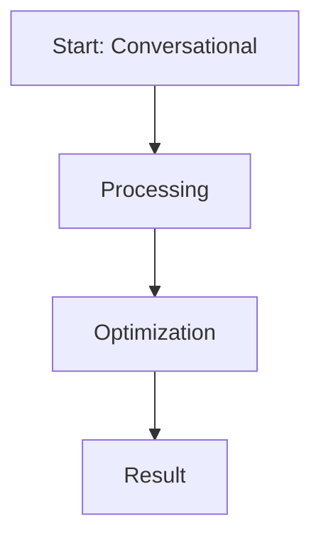

# Conversational Persona and Formatting Alignment for LLMs

This page provides detailed information about **Conversational Persona and Formatting Alignment for LLMs**.

## Overview
Conversational Persona and Formatting Alignment for LLMs is a critical component in the evolution of Direct Preference Optimization and Large Language Model alignment.

## Diagram

[Back to main README](../README.md)
