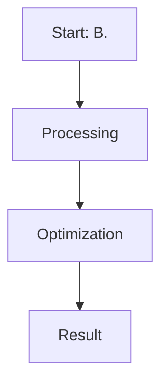

# B. Identity Preference Optimization (IPO)

This page provides detailed information about **B. Identity Preference Optimization (IPO)**.

## Overview
B. Identity Preference Optimization (IPO) is a critical component in the evolution of Direct Preference Optimization and Large Language Model alignment.

## Diagram

[Back to main README](../README.md)
