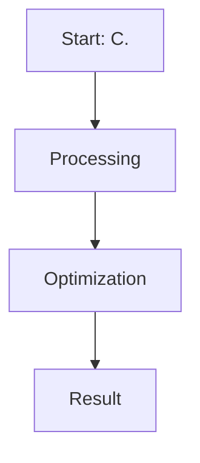

# C. Kahneman-Tversky Optimization (KTO)

This page provides detailed information about **C. Kahneman-Tversky Optimization (KTO)**.

## Overview
C. Kahneman-Tversky Optimization (KTO) is a critical component in the evolution of Direct Preference Optimization and Large Language Model alignment.

## Diagram

[Back to main README](../README.md)
