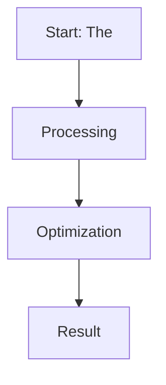

# The Likelihood Saturation and Capability Collapse Wall

This page provides detailed information about **The Likelihood Saturation and Capability Collapse Wall**.

## Overview
The Likelihood Saturation and Capability Collapse Wall is a critical component in the evolution of Direct Preference Optimization and Large Language Model alignment.

## Diagram

[Back to main README](../README.md)
