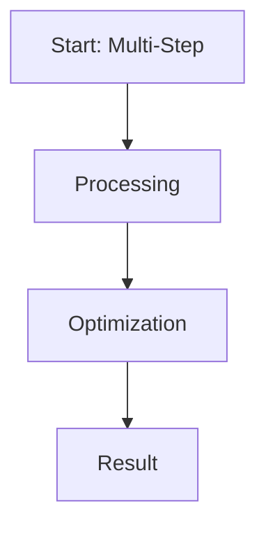

# Multi-Step Reasoning Refinement & Distillation

This page provides detailed information about **Multi-Step Reasoning Refinement & Distillation**.

## Overview
Multi-Step Reasoning Refinement & Distillation is a critical component in the evolution of Direct Preference Optimization and Large Language Model alignment.

## Diagram

[Back to main README](../README.md)
