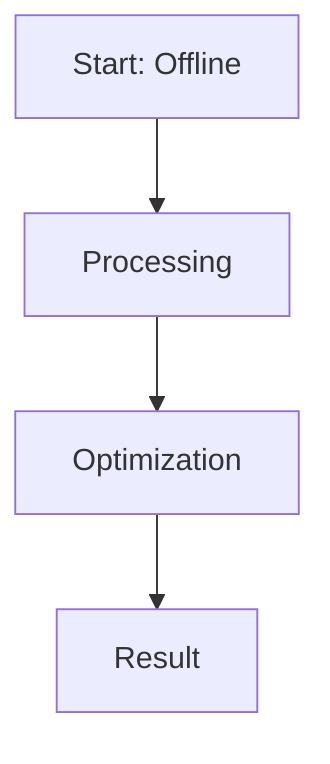

# Offline DPO (The Static Framework)

This page provides detailed information about **Offline DPO (The Static Framework)**.

## Overview
Offline DPO (The Static Framework) is a critical component in the evolution of Direct Preference Optimization and Large Language Model alignment.

## Diagram

[Back to main README](../README.md)
