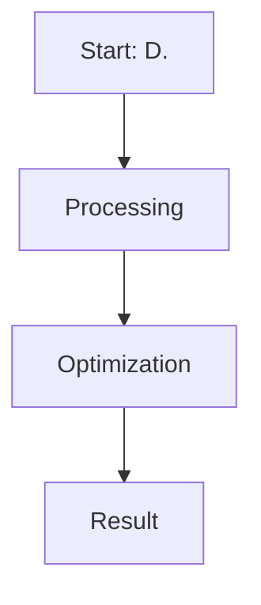

# D. Odds Ratio Preference Optimization (ORPO)

This page provides detailed information about **D. Odds Ratio Preference Optimization (ORPO)**.

## Overview
D. Odds Ratio Preference Optimization (ORPO) is a critical component in the evolution of Direct Preference Optimization and Large Language Model alignment.

## Diagram

[Back to main README](../README.md)
