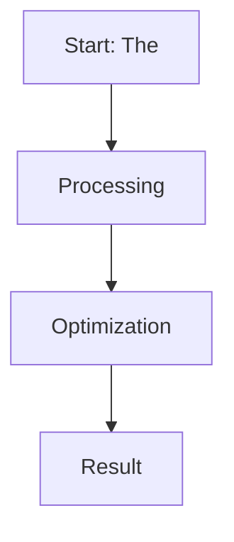

# The Reference-Free & Iterative Online Era (~2024–Present)

This page provides detailed information about **The Reference-Free & Iterative Online Era (~2024–Present)**.

## Overview
The Reference-Free & Iterative Online Era (~2024–Present) is a critical component in the evolution of Direct Preference Optimization and Large Language Model alignment.

## Diagram

[Back to main README](../README.md)
