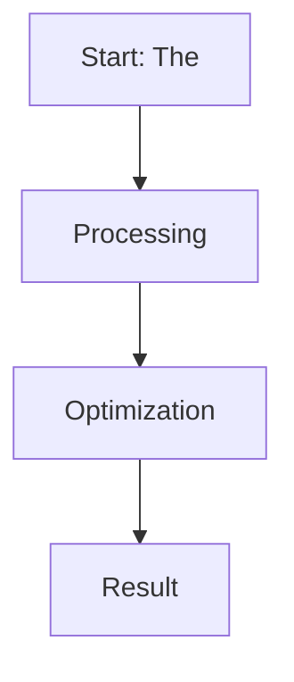

# The Reference Model Memory-Overhead Barrier

This page provides detailed information about **The Reference Model Memory-Overhead Barrier**.

## Overview
The Reference Model Memory-Overhead Barrier is a critical component in the evolution of Direct Preference Optimization and Large Language Model alignment.

## Diagram

[Back to main README](../README.md)
