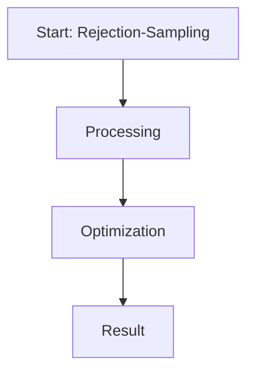

# Rejection-Sampling DPO

This page provides detailed information about **Rejection-Sampling DPO**.

## Overview
Rejection-Sampling DPO is a critical component in the evolution of Direct Preference Optimization and Large Language Model alignment.

## Diagram

[Back to main README](../README.md)
