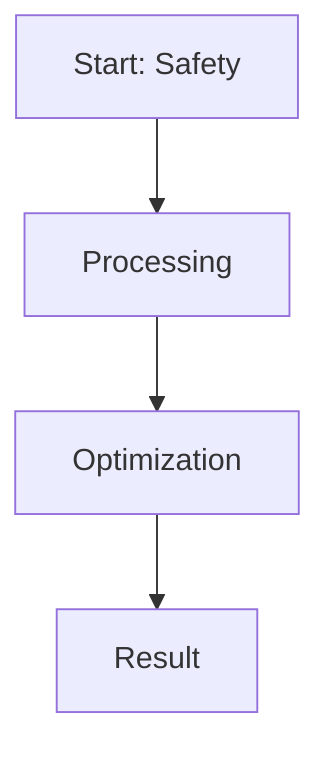

# Safety Guardrail Hardening and Red-Teaming Defense

This page provides detailed information about **Safety Guardrail Hardening and Red-Teaming Defense**.

## Overview
Safety Guardrail Hardening and Red-Teaming Defense is a critical component in the evolution of Direct Preference Optimization and Large Language Model alignment.

## Diagram

[Back to main README](../README.md)
