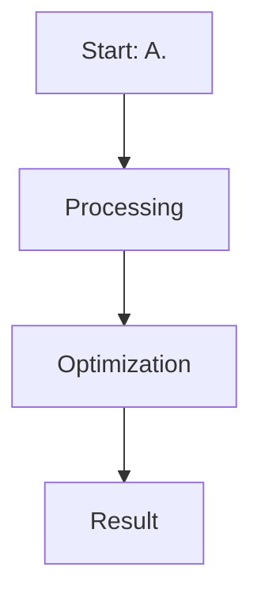

# A. Standard DPO (Bradley-Terry Formulation)

This page provides detailed information about **A. Standard DPO (Bradley-Terry Formulation)**.

## Overview
A. Standard DPO (Bradley-Terry Formulation) is a critical component in the evolution of Direct Preference Optimization and Large Language Model alignment.

## Diagram

[Back to main README](../README.md)
